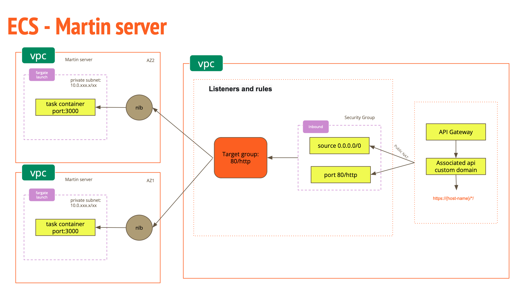

# Martin Stack CDK

This is a CDK stack to deploy the Martin server in the AWS environment, It is a useful stack to deploy any project in the AWS what you want to deploy.

## Table of contents

- [Get Started CDK](#get-started-cdk)
- [About the project](#about-the-project)
- [Environment Variables](#environment-variables)
- [First Time Setup](#first-time-setup)
- [Deploy the stack](#deploy-the-stack)


## Get Started CDK

This project is set up like a standard Python project. The initialization process also creates a virtualenv within this project, stored under the `.venv` directory. To create the virtualenv, you will need to have Python 3 installed.
But the version of Python 3 should be 3.6 or later and requirements.txt file should be present in the root directory of the project and following dependencies below here.

```dotenv
attrs==23.2.0
aws-cdk-lib==2.95.0
aws-cdk.asset-awscli-v1==2.2.202
aws-cdk.asset-kubectl-v20==2.1.2
aws-cdk.asset-node-proxy-agent-v6==2.0.1
aws-cdk.aws-apigatewayv2-alpha==2.95.0a0
aws-cdk.aws-apigatewayv2-integrations-alpha==2.95.0a0
cattrs==23.2.3
constructs==10.3.0
exceptiongroup==1.2.0
importlib-resources==6.1.1
jsii==1.94.0
publication==0.0.3
python-dateutil==2.8.2
python-dotenv==1.0.0
six==1.16.0
typeguard==2.13.3
typing-extensions==4.9.0
zipp==3.17.0
```

To manually create a virtualenv on MacOS and Linux:

```
$ python3 -m venv .venv
```

After the init process completes and the virtualenv is created, you can use the following
step to activate your virtualenv.

```
$ source .venv/bin/activate
```

If you are a Windows platform, you would activate the virtualenv like this:

```
% .venv\Scripts\activate.bat
```

Once the virtualenv is activated, you can install the required dependencies.

```
$ pip install -r requirements.txt
```

At this point you can now synthesize the CloudFormation template for this code.

```
$ cdk synth
```

To add additional dependencies, for example other CDK libraries, just add
them to your `setup.py` file and rerun the `pip install -r requirements.txt`
command.

## Useful commands

 * `cdk ls`          list all stacks in the app
 * `cdk synth`       emits the synthesized CloudFormation template
 * `cdk deploy`      deploy this stack to your default AWS account/region
 * `cdk diff`        compare deployed stack with current state
 * `cdk docs`        open CDK documentation

Enjoy!


## About the project

- This project is a CDK stack to deploy the Martin server in the AWS environment, It is a useful stack to deploy any project in the AWS what you want to deploy,
- The Martin is a serverless application for displaying the vector tiles on the map, It is a useful application to display the vector tiles on the map.

[//]: # (Get image from my assets)



## Environment Variables

Environment variables are used to deploy stack cdk in the AWS environment. The following environment variables are required:
You can modify the environment variables in the **.cdk-stack-dev.env** file.

```dotenv
# Path: .cdk-stack-prod.env (for local development) for the martin ecs server
AWS_ACCOUNT_ID=811478435729
AWS_DEFAULT_REGION=ap-southeast-1

# For the martin-eoapi-service
VPC_ID=vpc-09a86d723258c009e
EXECUTION_ROLE_ARN=arn:aws:iam::811478435729:role/ECSTaskExecutionRole
CLUSTER_NAME=cluster-martin-eoapi-service
ECS_CPU=4096
ECS_MEMORY=8192
API_NAME=martin-eoapi-service
LOAD_BALANCER_NAME=martin-eoapi-alb-dev
SERVICE_NAME=martin-eoapi-dev-service
IMAGE_URI="811478435729.dkr.ecr.ap-southeast-1.amazonaws.com/martin-eoapi-dev:latest"
STACK_NAME=martin-eoapi-service
PRIVATE_WITH_NAT=true
```

## First Time Setup

- First, you need to build docker image for the martin-eoapi-service and push to the ECR repository.
- Then you need to deploy the stack in the AWS environment.

```bash
$ docker build -t martin-dev .
$ docker tag martin-dev:latest {AWS_ACCOUNT_ID}.dkr.ecr.{AWS_DEFAULT_REGION}.amazonaws.com/martin-eoapi-dev:latest
$ docker push {AWS_ACCOUNT_ID}.dkr.ecr.{AWS_DEFAULT_REGION}.amazonaws.com/martin-eoapi-dev:latest
```

## Deploy the stack

- To deploy the stack in the AWS environment, you need to run the following command.

```bash
$ cdk deploy
```
